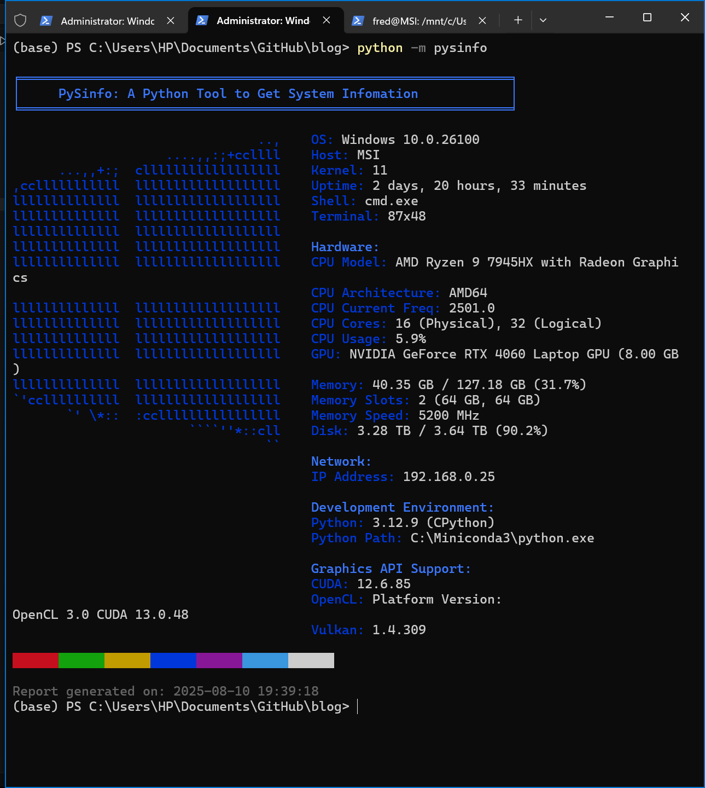
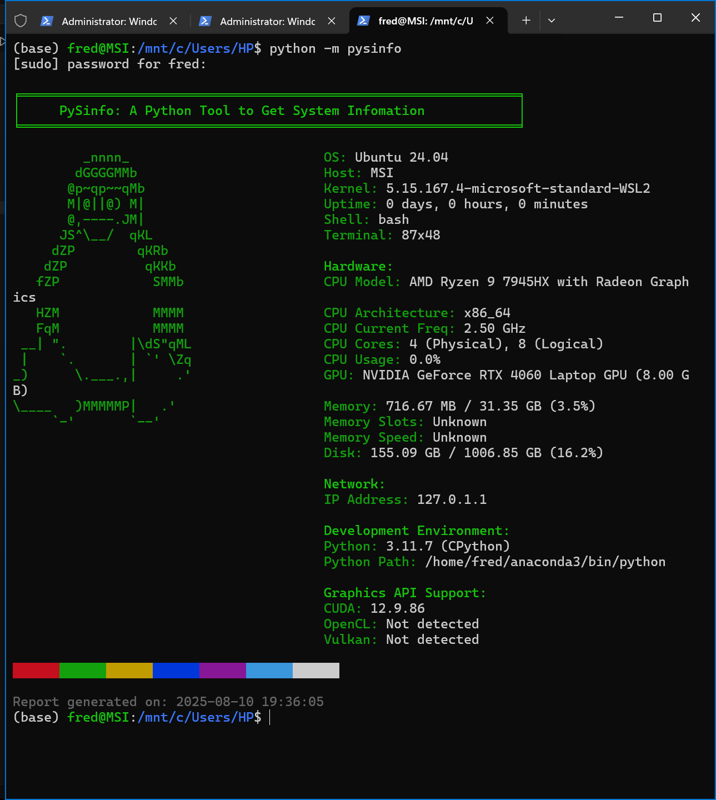

# PySInfo：一个 Python 命令行工具，用于显示当前系统的信息

写代码，跑模型，日常难免要查看设备配置。
经常遇到一些朋友问自己的配置能否跑某一模型，但有的朋友可能对自己的配置也不一定总是很熟记于心。
尤其是有的时候云服务器等等很可能都是没有GUI的，只有CLI，要查看配置需要用一些第三方工具。
以前我一直用 neofetch，但安装和依赖有点偏重。
于是前一段时间就顺手用 Python 做了个轻量工具，开箱即用，把关键的硬件与软件信息一屏展示。
这个项目只有几百行代码，虽然不一定美，但确实挺小的，方便自己也方便大家随取随用。
注意：Linux下运行的时候要求输入super user密码，这只是为了获取硬件信息，绝对不会有任何联网的。


## 安装

### 从源码运行

```Bash
git clone https://github.com/EasyCam/Pysinfo.git
cd Pysinfo
python -m pip install -r requirements.txt
python -m pysinfo
```

### 通过 PyPI 安装

```Bash
pip install pysinfo
python -m pysinfo
```

## 示例



